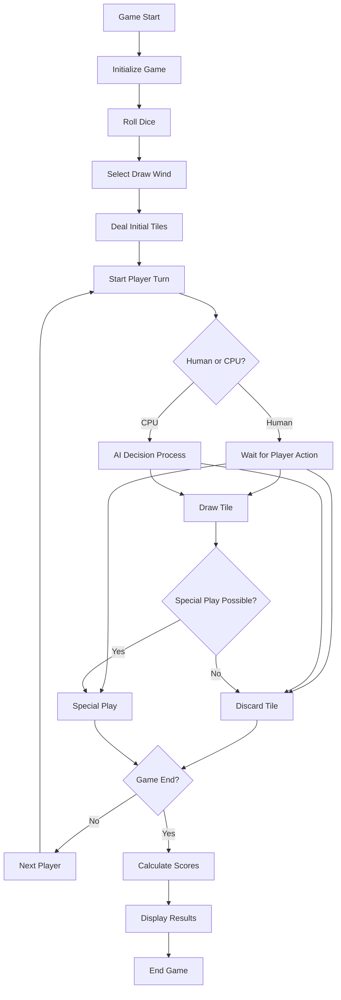

# MJ - Mahjong Game

A Mahjong game implementation in Godot 4.4, featuring both human and CPU players, realistic tile mechanics, and traditional gameplay.

## Game Overview

This project implements a digital version of the traditional tile-based game Mahjong. Players draw and discard tiles, aiming to complete sets and win by forming a valid hand.

### Features

- Complete Mahjong gameplay with 4 players (1 human, 3 CPU)
- Traditional tile sets (Suits, Winds, Dragons, Flowers)
- Realistic table physics and tile interactions
- Special plays (Pong, Kong, Chow) - *partially implemented*
- Wind rotation system based on rounds
- Dice mechanics for determining draw position

## Project Structure

The project has been reorganized into a cleaner folder structure:

```
MJ/
├── scripts/            # Game scripts organized by purpose
│   ├── core/           # Core game functionality
│   │   ├── game.gd
│   │   ├── game_state.gd
│   │   └── notification_handler.gd
│   ├── players/        # Player-related scripts
│   │   ├── Human.gd
│   │   ├── CPU.gd
│   │   └── player_hand.gd
│   ├── tiles/          # Tile-related scripts
│   │   ├── tile.gd
│   │   └── tile_data.gd
│   ├── table/          # Table and gameplay area
│   │   ├── table.gd
│   │   ├── table_tiles.gd
│   │   └── discard.gd
│   └── ui/             # User interface scripts
│       ├── HUD.gd
│       ├── user_portrait.gd
│       └── die.gd
├── scenes/             # Game scenes organized by purpose
│   ├── ui/             # UI-related scenes
│   │   ├── notification_panel.tscn
│   │   └── user_portrait.tscn
│   ├── game_objects/   # Individual game object scenes
│   │   ├── tile.tscn
│   │   ├── die.tscn
│   │   └── table_area.tscn
│   └── main/           # Main game scenes
│       └── game.tscn
└── resources/          # Game resources
    └── images/         # Image assets
        └── icon.svg
```

## Game Flow

The flow of the game follows traditional Mahjong rules with some simplifications:



### Detailed Game Flow Explanation

1. **Game Start & Initialization**
   - Game loads all tile data
   - Shuffles the full set of tiles
   - Places tiles in stacks around the table

2. **Dice & Wind Selection**
   - Three dice are rolled
   - The sum determines the starting draw position and wind

3. **Initial Tile Distribution**
   - Players draw tiles in groups of 4 until each has 13 tiles
   - Flower tiles are automatically exposed and replaced

4. **Player Turns**
   - Each player's turn consists of:
     - Drawing a tile
     - (Optional) Making a special play
     - Discarding a tile
   - CPU players use basic AI to make decisions

5. **Special Plays**
   - Pong: Claim a discarded tile to form a triplet
   - Kong: Claim a discarded tile to form a quadruplet
   - Seung: Claim a discarded tile to form a sequence (only from the previous player)
   - These interrupt the normal turn order when claimed

6. **Game End**
   - Game ends when a player forms a complete valid hand
   - Scores are calculated based on hand composition
   - Winner is determined

## Development

### Requirements

- Godot 4.4.1 or newer

### Getting Started

1. Clone the repository
2. Open the project in Godot
3. Press F5 to run the game

## GitHub Actions & itch.io Setup

This project uses GitHub Actions to automatically build and deploy to itch.io when pushing to the main branch or creating a new tag.

### Setting up the itch.io Deployment

To make the GitHub Actions workflow work with your itch.io account, you need to set up the following in your GitHub repository:

1. Go to your GitHub repository
2. Click on "Settings" > "Secrets and variables" > "Actions"
3. Add the following secret:
   - `BUTLER_API_KEY`: Your itch.io API key (get it from https://itch.io/user/settings/api-keys)

4. Under the "Variables" tab, add:
   - `ITCH_USERNAME`: Your itch.io username
   - `ITCH_GAME_NAME`: The URL name of your game on itch.io

For example, if your game URL is `https://username.itch.io/my-game`, then:
- `ITCH_USERNAME` would be "username"
- `ITCH_GAME_NAME` would be "my-game"

The workflow will:
- Build for Web, Windows, macOS, and Linux
- Upload each build as an artifact to GitHub Actions
- Publish each build to the appropriate channel on itch.io

### Manual Deployment

If you prefer to manually deploy your game:

1. Install Butler: https://itch.io/docs/butler/
2. Login to Butler: `butler login`
3. Build your game
4. Push to itch.io: `butler push build/web username/game-name:html5`
